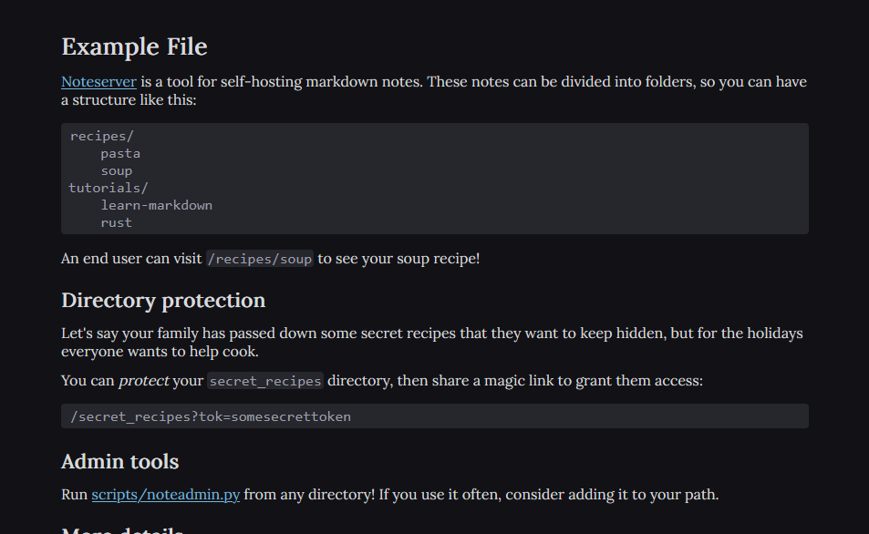

# noteserver

A tool for self-hosting and sharing my markdown notes!

[Example shared document](https://notes.cadenlee.dev/misc/example)

## Features
### As a user
Every note is inside a directory:
- To read a note, head to `/{directory}/{note}`.
- To see a list of all the notes in a directory, just go to `/{directory}`.

You can also view the raw Markdown version by clicking the "raw" link at the bottom, and switch between light and dark theme.

### As an admin
Feel free to use the admin tool (`/scripts/noteadmin.py`), which supports:
- Bulk uploading markdown files from a folder on your computer to a directory
- Managing directories/notes
- Managing tokens

Under the scenes, the following endpoints (all of which require your authorization as a header) are available.
- `/{directory}`: post/delete a directory. Pass:
    - The description as the body
    - Optionally, whether it's protected as a query parameter
- `/{directory}/{note}`: post/delete a note. The directory must exist. Pass:
    - The Markdown contents as the body
- `/token/{tok}`: post/delete a token to grant people access to protected directories. Pass:
    - The directory the token unlocks as a query parameter
- `/all`: get an overview of all directories and active tokens

To grant someone access to a protected directory, first create a token for it, then provide them with the magic link `/{directory}?tok=somesecrettoken`. Anyone with this link will have access until you delete the token.

## Development
1. Copy `.env.example` into `.env`
    - Ensure you have a PostgreSQL database URL set
    - A utility is provided for hashing your password (see comment)
2. `cargo run`
    - The database schema will be populated at build time

A dockerfile is provided for deployment

## Tech stack
Though this serves HTML, it uses zero JavaScript, and instead generates HTML in the Rust Axum API (this was mainly done as a fun learning experience). The markdown is entirely rendered on the server, and users' tokens and theme settings persist via cookies.

The notes themselves are stored in a Postgres database, because markdown notes aren't bloated enough to warrant storage buckets.
